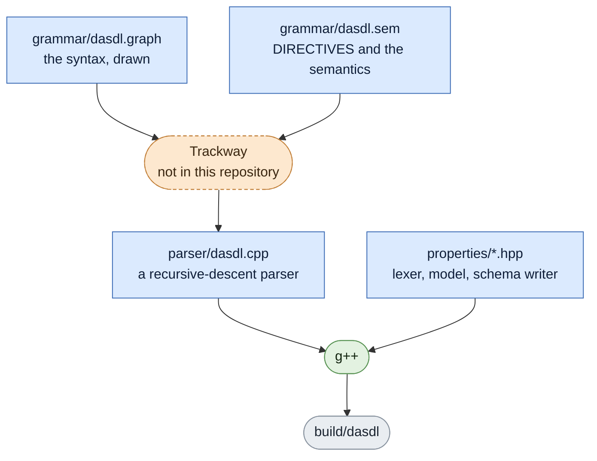
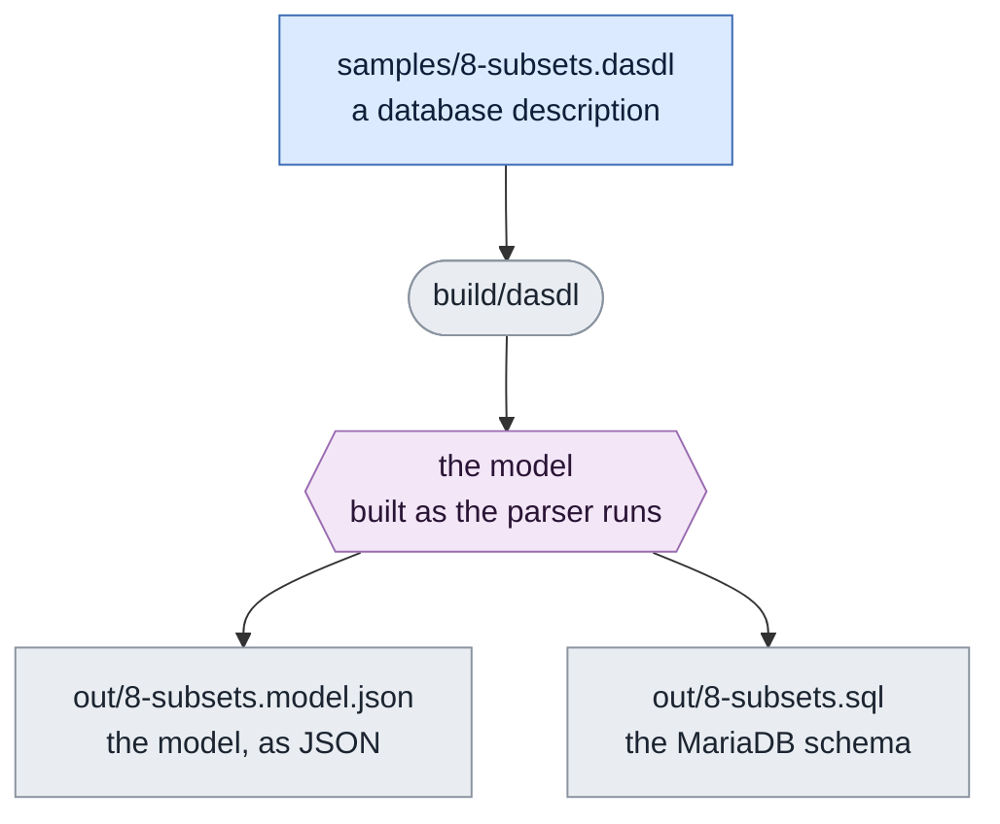

# DASDL

A front end for DASDL — the language a Unisys ClearPath MCP database uses to
describe itself — that runs on a PC. It reads a description, builds a model of
the database, and writes out both that model, as JSON, and a MariaDB schema
generated from it. It also runs [in a browser
tab](https://adolfocl.github.io/DASDL/), with nothing to install.

The grammar is drawn, not written:

```
<SET DECLARATION>:

>>█── SET(1) ── OF ── IDNTOK(2) ── [<WHERE CONDITION>] ── [<SET TYPE>] ── [<PHYSICAL OPTIONS>] ──█<<
```

The numbers are stations. When the parser reaches one it runs the code kept for
it in `grammar/dasdl.sem`:

```
@@BEGIN_SEM <SET DECLARATION>@@
'1': {'C': {'text': ['model.setKind("set");']}},
'2': {'C': {'text': ['model.setTarget(token.value);']}}
@@END_SEM@@
```

101 entities, 71 of them carrying semantics. That is the whole compiler.

## What you need

A C++17 compiler. Nothing else — no interpreter, no libraries, no package
manager, no network.

That is a short list, but it hides a real requirement: **`g++` has to be
installed on your machine, and on most machines it is not.** A stock Ubuntu
desktop, a fresh macOS and every Windows install ship without a C++ compiler.

| | |
|---|---|
| Debian, Ubuntu | `sudo apt install g++ make` |
| Fedora, RHEL | `sudo dnf install gcc-c++ make` |
| Arch | `sudo pacman -S gcc make` |
| macOS | `xcode-select --install` — the `g++` it gives you is Apple clang answering to that name, which does the job |
| Windows | Install WSL, then the Debian line inside it |

`g++ --version` has to answer 7 or later. That is where C++17 arrived.

## Try it

```
make compile
```

Builds the front end and runs it over the eight sample descriptions from the
Unisys manual, writing a `.model.json` and a `.sql` for each into `out/`.

To read one description:

```
make build
build/dasdl -s samples/8-subsets.dasdl -o out/8-subsets
```

It writes `out/8-subsets.model.json` and `out/8-subsets.sql`. The schema is
written from the model in memory, not from the JSON: there is no second program
and no round trip through a file, so the two outputs cannot disagree.

`--maintain` says who keeps the automatic subsets current: `triggers`, the
default, has the server do it; `runtime` leaves the tables and skips the
triggers. `DASDL_NO_SQL=1` stops after the model, for a syntax-only run.

## Running it without trusting it

You are being asked to compile a stranger's C++ and run it on your own
machine, which is a fair thing to be wary of. So here is what this program
can do, stated plainly and checkable in one command:

```
grep -rE '(system|popen|exec|fork|socket|dlopen)[[:space:]]*\(' parser/ properties/
```

It finds nothing, and that is the point. The program opens the description you
name, writes the two files you name, and does nothing else: it starts no
process, opens no socket, loads no library at run time, and touches no file it
was not told about. `ldd build/dasdl` answers with the C and C++ runtimes and
nothing more. The two environment variables it reads, `DASDL_NO_SQL` and
`DASDL_TRACE_TOKENS`, only turn output off and on.

Nothing here fetches anything either. `make compile` reads what is already in
this directory and writes into `build/` and `out/`, and `make clean` removes
both.

## Or install nothing at all

**[Run it in your browser](https://adolfocl.github.io/DASDL/)** — the compiler
itself, not a recording of it, in English or Spanish. Pick one of the manual's
descriptions and change it, start from a blank sheet, or open a `.dasdl` file
off your own disk; the file is read in the tab and goes nowhere. Breaking a
description on purpose is a fair way to see what the grammar knows: it answers
with the line, the column and what it expected.

`make web` compiles the same C++ to WebAssembly and writes
`build/web/dasdl.html`: one self-contained file that runs the compiler in a
browser tab. Open it straight off the disk or put it behind any static host. It
fetches nothing — not a script, not a font, not your description — so there is
nothing for it to send anywhere, and no server to send it to.

Same program, same answers: the WebAssembly build's output is byte-for-byte
identical to the `g++` build's on all eight samples.

That target is the only thing here that wants more than a C++ compiler. It
needs Emscripten, which is not packaged by any distribution worth using and is
installed from its own SDK:

```
git clone https://github.com/emscripten-core/emsdk.git ~/emsdk
~/emsdk/emsdk install 6.0.8
~/emsdk/emsdk activate 6.0.8
source ~/emsdk/emsdk_env.sh
```

That last line puts `em++` on the PATH **of that shell and no other**, so a new
terminal needs it again — which is the usual reason `make web` suddenly cannot
find the compiler it found yesterday. It is about 1.7 GB, and none of it is
needed to build or run the compiler itself.

Note `em++` and not `emcc`. `emcc` is the C driver: it compiles the C++ and
then fails at the link step with undefined `std::` symbols, which does not look
like the mistake it is.

## Two files, one grammar

`grammar/dasdl.graph` is the syntax and nothing else, so it can be read as
syntax. `grammar/dasdl.sem` holds the Trackway configuration and the semantic
blocks, each with the comment explaining it. Trackway wants the two as a single
file; recombining them is a step that happens outside this repository.

## How the parser gets made

No C++ here is written by hand except the runtime. The grammar is drawn, a
generator turns the drawing into a parser, and a compiler turns that into a
binary.



Blue is tracked in this repository, grey is generated and ignored, dashed
orange is not here at all. A rounded box runs; a square one is a file.

**Trackway is not here.** It is a compiler generator that reads railroad
diagrams and emits a recursive-descent parser, in C++, Java, Python or ALGOL,
and it is self-hosting — it compiles itself from its own syntactic definition.
It is a separate project and is licensed separately.

So you can build this compiler and change what it does with a description, by
editing the model and the SQL generator. You cannot regenerate `dasdl.cpp` from
the grammar without Trackway. That is deliberate, and saying it plainly seemed
better than letting you find out.

## What compiling a description does

The binary reads a description and writes two files. Both are written from the
same model in memory, which is why they cannot disagree with each other.



The model never reaches the disk on its way to the schema. `dasdl_sql.hpp`
reads the same `Database` the semantic actions built, so the `.sql` is not a
second reading of the `.json` — it is a second writing of the same thing.

## What is here

| | |
|---|---|
| `grammar/` | The railroad grammar and its semantics |
| `parser/dasdl.cpp` | The parser Trackway generated from them |
| `properties/` | The model DASDL builds, and the lexer and parser runtime |
| `properties/dasdl_sql.hpp` | Model → MariaDB schema |
| `samples/` | Eight descriptions from the Unisys DASDL manual |
| `web/` | The browser page, and the fonts it embeds so it fetches nothing |

## What this is not

This reads a database description. It does not move any data.

Getting data out of a live DMSII database is a different problem, and a harder
one: you read the audit trail rather than the database, apply the changes as
each block is written, and survive a reorganisation without anybody being
called at three in the morning. That side runs on the MCP machine, in DMALGOL
and WFL, and it is not published.

[dmsii-to-sql](https://github.com/AdolfoCl/dmsii-to-sql) shows what this front
end produces on a production description: 19,011 lines of DASDL into 780
tables, 69 indexes and 1,034 triggers, in 0.29 seconds.

## Author

Adolfo Díaz — Unisys ClearPath MCP: DMSII, DASDL, WFL, COBOL-74, ALGOL, and the
compilers for them. adolfo.diaz@ies.cl

DASDL is a Unisys language; the samples are short excerpts from *Enterprise
Database Server DASDL Programming Reference Manual*, 8600 0213-424, reproduced
for reference. Unisys has no connection with this work.

## License

MIT — see [LICENSE](LICENSE).
